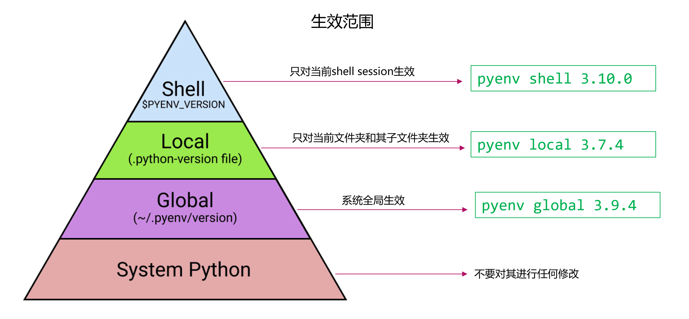

pyenv的基本使用
======================

python版本的安装
-----------------

``pyenv install --list`` 查看可安装的python版本

``pyenv install 3.9.4`` 具体安装某一python版本

python版本的查看和设置
---------------------------

``pyenv versions`` 查看本地已安装的python版本，以及目前激活的版本

``pyenv global 3.9.6`` 设置全局python版本

.. code-block:: bash

    pyenv versions
    3.7.8
    3.8.10
    * 3.9.6 (set by C:\Users\Peng Xiao\.pyenv\pyenv-win\version)

三个层级的python版本设置
--------------------------

